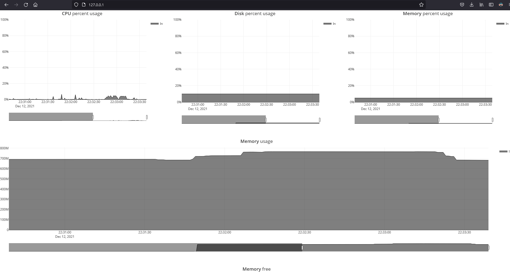

#  Realtime-server-stats

> Monitoring your server at realtime.

<p align="center"></p>

#

## Dependencies

- Docker
- Docker-compose

## How to run:
```shell
$ docker-compose up -d
```

Wait to install composer dependencies...

Open http://127.0.0.1:80
